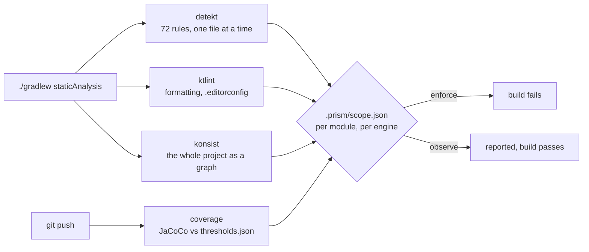
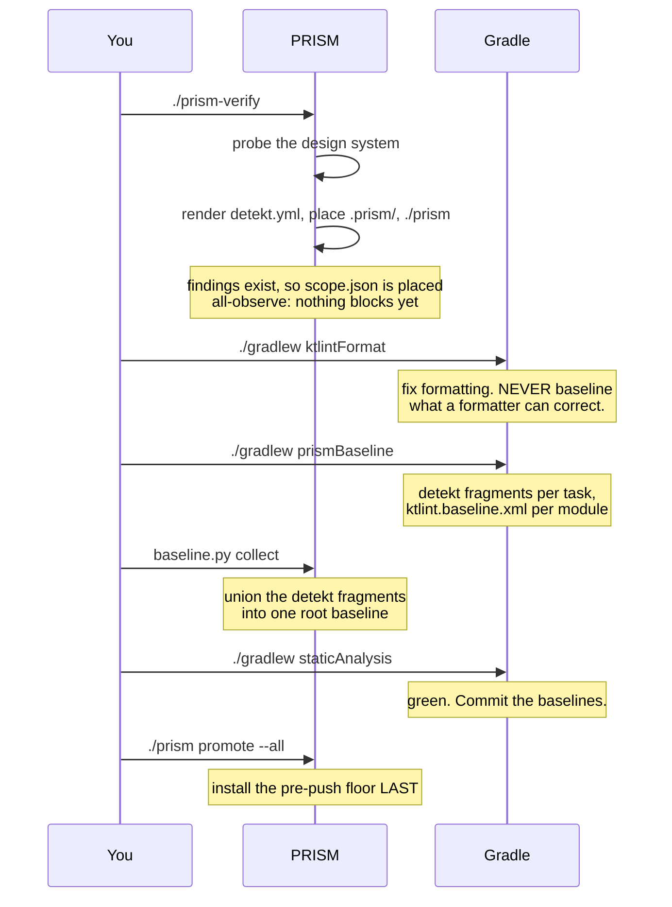

# Adopting PRISM in a codebase that already exists

Installed at `.prism/INSTALL-BROWNFIELD.md`.

PRISM was extracted from a repository that grew up under its own gates. Yours
did not. Installing at full strength into an existing codebase means day one is
a red build with several hundred findings, none of which are about the work you
were doing — and the usual outcome of that is the whole thing gets switched off
in week two.

This document is how not to do that.

---

## What PRISM will find, and what the number means

Four engines run. Each reports independently:



A finding is not a bug report about you. Most of what you see on day one is a
convention this repository never adopted — PRISM's test-stack rules assume
JUnit 5 and AssertK, so a suite built on JUnit 4 and Truth reports **every test
file**, and no amount of restructuring makes that go away.

**That is expected, and it is not a reason to switch rules off.** It is a reason
to observe them.

---

## The install, in order

The order matters and it is not the obvious one.



**Install the floor last.** Do it first and every push is refused, because
`staticAnalysis` is not wired yet or the findings were about to be recorded.

**Never run `./gradlew detektBaseline` on its own.** detekt's own task *replaces*
the file it is pointed at, so on a multi-module repository fifteen tasks writing
one root file leave the last module's findings and nothing else — a baseline
that looks complete and covers one module. `prismBaseline` writes a fragment per
task and a second pass unions them.

**Commit the baselines.** Every `<module>/detekt.baseline.xml` and every
`<module>/ktlint.baseline.xml` are the record of what was already here. They are
deliberately not in the `.gitignore` fragment.

---

## Where you stand, at any time

```sh
./prism status
```

```
POSTURE — what blocks, per module

MODULE                             detekt    ktlint    konsist   coverage
:app                               observe   observe   observe   observe
:core:data                         observe   observe   observe   observe
:feature:login                     enforce   enforce   enforce   enforce

SUPPRESSED — what was already here when PRISM arrived

  detekt   41 findings suppressed, so they do not block
  ktlint   1 module baseline(s):
           app                                            12 entries

  A suppressed finding does not block. A NEW violation of the same rule
  still does — that is the whole difference between a baseline and
  switching a rule off.

COVERAGE — what the coverage gate would say right now

MODULE                             KIND            STATE              COVERAGE REQUIRED
---------------------------------------------------------------------------------------
:app                               android-jvm     observe (short)         61.2       80
:core:data                         jvm             observe (clears)        88.0       80
:feature:login                     jvm             ok                      91.4       80
```

Three sections, and they mean different things. **Posture** is what blocks.
**Suppressed** is what was already here. **Coverage** is what the gate would say
if you pushed right now. A module can be `enforce` with a large
baseline — that is the normal mid-adoption state, and it means *new* code in
that module is held to the standard while the old code waits its turn.

---

## Promoting a module

**The one rule: achieve the coverage first, promote second.** Coverage is the
only engine that does not run in `./gradlew staticAnalysis` and does not run
locally at all — it runs at `git push`. Promote a module before its tests exist
and you get a green local build and a refused push, with nothing on screen
connecting the two.

**Check that your tests compile, with `./gradlew test` — not with `ls`.** A
`src/test/` directory is not a working test framework. On one measured
repository *no unit test compiled in any module*: the JVM convention plugin
added no test dependencies at all, and the Android ones added only
`kotlin("test")`, which with no framework on the classpath resolves to a base
artifact where even `kotlin.test.Test` is unresolved. Nineteen template test
files were dead code and nothing said so.

### Which module first

Start at the **leaves of the dependency graph** — modules nothing else depends
on for compilation, and which depend on least themselves. They are smallest,
they have the fewest framework entanglements, and a mistake in one does not
cascade.

In a Now-in-Android-shaped repository that usually means `:core:domain`: no
Android dependencies, no framework types, and the module whose correctness
matters most. Work outward — `:core:*` before `:feature:*`, and `:app` last,
because `:app` is where the release configuration, the instrumented suite and
every dependency meet at once.

### See where it stands, then fix it

```sh
./prism status                 # every module against every engine
./prism status :core:domain    # and the coverage numbers for one
```

Read the findings, do not just count them:

```
core/domain/build/reports/detekt/detekt.html            ← browse
core/domain/build/reports/detekt/detekt.xml             ← what the gate parses
tooling/konsist/build/reports/tests/test/index.html     ← architecture tests
```

ktlint writes no file — re-run `./gradlew ktlintCheck` and read the console.

```sh
./gradlew ktlintFormat      # formatting first, always
```

### Check coverage before you promote, not after

This is the step people skip, and it costs them a failed push. `./prism promote
:module` sets **all four engines**, coverage included, and coverage does not run
in `staticAnalysis`. So a module promoted at 40% passes a green local build and
is refused the first time you push.

```sh
./prism coverage :core:domain
./prism status :core:domain
```

If it says `would DENY (low)`, write the tests now.

### Commit, then promote

**Commit first.** Promotion drops baseline entries, and that is not undone by
setting the posture back.

```sh
git add -A && git commit -m "core:domain clean and covered"
./prism promote :core:domain
./gradlew staticAnalysis          # green = those findings really were fixed
```

What that command does, in this order:

1. **deletes** `core/domain/detekt.baseline.xml`,
2. **deletes** `core/domain/ktlint.baseline.xml`,
3. sets all four engines to `enforce` for `:core:domain` in `scope.json`.

Suppressions first, posture second — the other order leaves a window in which
the module blocks on findings that were always going to be dropped.

### Set the floor, if you want it above the default

Posture and floor are **two different questions**:

| Question | Answered by |
|---|---|
| does coverage **block** for this module? | `.prism/scope.json` → `"coverage": "enforce"` |
| what number must it **clear**? | `.prism/verify/thresholds.json` |

```jsonc
{
  "default": 80,
  "overrides": { ":core:domain": 100 }
}
```

`:core:domain` at 100 is what `overrides` is for — security-critical algorithmic
code, where 80% means one line in five of your crypto is never executed by a
test. An override may **start below** the default — that is the supported
on-ramp — but it can only ratchet up: the push guard denies lowering `default`,
lowering an existing override, or removing one.

### Prove it, differentially

A clean module passing an enforced gate proves nothing on its own. Plant the
*same* violation in the module you promoted and in one you did not:

| Where | Expected |
|---|---|
| the promoted module | the build **fails** |
| an observed module | the finding is **printed**, the build passes |

If both fail, you did not promote a module — you promoted the default. If
neither fails, the gate is not live at all.

> **A green build can lie about this.** Gradle's configuration cache carries the
> posture, because `ignoreFailures` is set at configuration time. If a promote
> appears to have done nothing, re-run with `--no-configuration-cache`.

### Then the next module

`./prism status` shows how much is left. Module by module is not as slow as it
looks: the first one is the expensive one — it is where you find out what your
convention plugins actually put on the test classpath — and siblings of the same
shape then take minutes, because the findings repeat.

### Two things that bite at multi-module scale

**The ktlint baseline is one file until it is not.** ktlint's Gradle plugin
defaults every module's task to the **root** `ktlint.baseline.xml`, so fifteen
module tasks write to one file and the last one wins. PRISM points each module's
task at its own, which is why promoting a module deletes a file in that module.

**One detekt id can appear in nineteen modules.** detekt computes a baseline id
from the rule and the finding, not from the path.
`JUnit4InJvmUnitTest:ExampleUnitTest.kt:import org.junit.Test` is **one id**,
identical in every module with a generated `ExampleUnitTest.kt` — measured at 19
of 26 on one repository. Retiring it in `:run:domain` retires it **only there**.
That is correct, and it is why the baselines are per module — but it means "I
fixed that rule" is a per-module claim, not a repository-wide one.

### Stepping back, if you have to

Set those engines back to `observe` in `.prism/scope.json`. That restores what
blocks — but **the baseline entries the promote dropped are gone.** Recover them
with `git checkout core/domain/detekt.baseline.xml core/domain/ktlint.baseline.xml`,
which only works because you committed first.

And you cannot demote **in the push that needed the demotion**. The guard
refuses it. Make it its own commit and merge that first.

### If this repository is one module

Then there is no module axis to walk, and you move engine by engine instead:
`./prism promote --engine detekt` once detekt is clean, then ktlint, konsist and
coverage. [Starting fresh](INSTALL-GREENFIELD.md) walks that axis in full — it
applies to a one-module codebase with history exactly as it does to a new one.

---

Two things that are specific to adopting, and belong here:

**A module created after the install is already fully enforced.** It has no
baseline entries, so there is nothing suppressing it, and it inherits whatever
`default` says. If you want new modules strict while the old ones catch up, set
`default` to `enforce` and list the legacy modules as `observe` — the file works
in both directions.

**A large baseline on an `enforce` module is normal.** It means *new* code in
that module is held to the standard while the old code waits its turn. That is
the mid-adoption state you are aiming for, not a sign something went wrong.

---

## The two things that will tempt you, and what to do instead

**"This rule reports everywhere, I'll turn it off."** `active: false` in
`detekt.yml` stops the rule *checking* — it never comes back, and neither does
the check. `prism-inventory.sh` (shipped with the test artifact, not installed)
reports every rule switched off outside the two
switchable groups, precisely because a lone `active: false` at line 300 looks
deliberate and is illegible six months later.

Observe the module instead. The rule still runs, the findings are still printed,
and a **new** violation still fails once you promote.

**"I'll regenerate the baseline, it's out of date."** Regenerating absorbs every
violation written since the last one, permanently, and nothing reports that it
happened. The collect step refuses over an existing baseline for that
reason. The workday operation is `drop`, which only ever subtracts.

> A rule switched off never comes back. A baselined finding does.

---

## Stepping backwards

You can demote a module. What you cannot do is demote it **in the same push that
needed the demotion**:

```
prism: this push weakens PRISM's own configuration relative to main.

  - .prism/scope.json: :feature:login detekt was demoted enforce -> observe

  A push may not both need a weakening and contain it.
```

Make it its own commit and merge it first, where the diff says plainly what
protection is being given up. The same guard covers `detekt.yml`,
`.editorconfig`, `thresholds.json` and the baselines — a rule switched off, an
exclusion widened, a coverage floor lowered, a baseline grown.

**Be clear about what that buys.** It is tamper-*evident*, not tamper-*proof*.
Every PRISM gate lives in a file you can edit, the guard included. What it
changes is that weakening now costs a separate, visible commit instead of one
line buried inside an unrelated change.

---

## Knowing when you are done

You are finished adopting when `./prism status` shows `enforce` everywhere and
both baselines are empty. At that point:

```sh
rm .prism/scope.json
git rm '*/detekt.baseline.xml'
```

and the install is now indistinguishable from one made into a repository that
was already clean. That is the target, and there is no deadline on it — but
`./prism status` is what keeps `observe` from becoming permanent by inattention.

---

**See also:** [`RULES.md`](RULES.md) for what each of the 72 rules catches,
the guide in the documentation folder for how the machinery works, and
[`VERIFY.md`](VERIFY.md) for proving the install is real.
